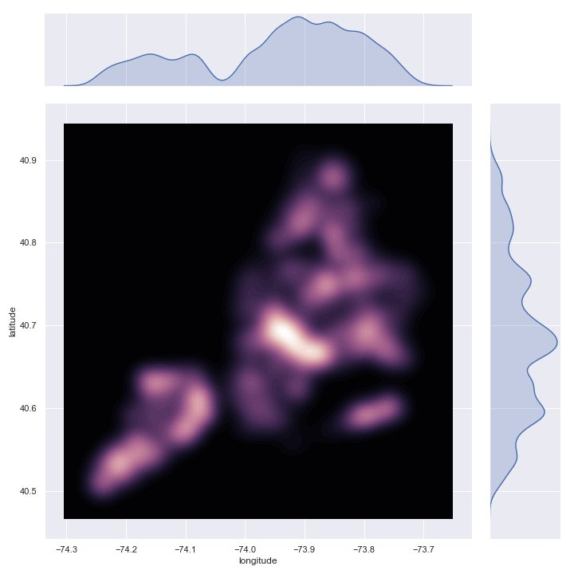
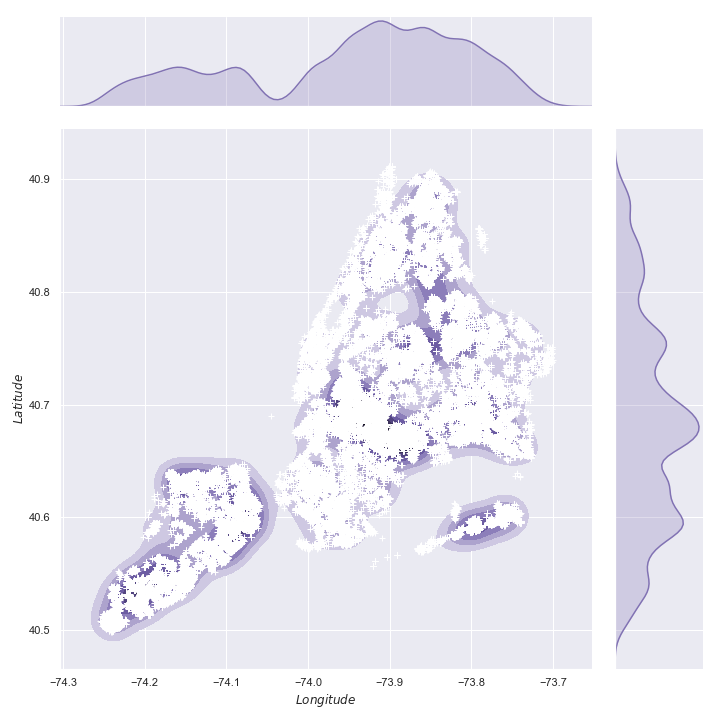

**Data Analysis Using Python: A Beginner’s Guide Featuring NYC Open Data**

Part 3: Plotting and Visualizations

*Mark Bauer*

# Figures

## Line Plot

## Area Plot

## Bar Plot

## Pie Plot

  

 

## Histogram

## Kernel Density Estimate (KDE) Plot

## Box Plot

## Scatter Plot

## Pair Plot

## Hexagonal Bin Plot

## Joint Plots

## Categorial Plots

